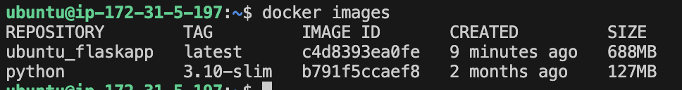

**Problem Statement:**

Create a RAG based chatbot using open source LLM on multiple webiste and docuements.

#### Architecture


#### Folder Structure
- rag.py -- Pipeline to run the whole rag process
- utils.py -- Each component of pipeline
- api.py -- Flask API using POST and GET method
- requirements.txt -- Dependencies library
- rag-dataset -- The dataset is used for creating chatbot
- Dockerfile -- dockerized version of the pplication
- docker-compose.yml -- Used to run the docker container

#### How to run the application locally?
Note that: This application is ran on Mac OS with Apple siicon chip

- step-1: Create conda env
```
conda create -n your_env_name python=3.10
conda activate your_env_name
pip install -r requirements.txt

# install pkg-config
conda install conda-forge::pkgconfig
```

- step-2: Setup your local [mysql database](https://dev.mysql.com/downloads/installer/)
```
# start the server
brew services start mysql

# create database and table
CREATE DATABASE chat_db;
USE chat_db;
CREATE TABLE chat_history (
    id INT AUTO_INCREMENT PRIMARY KEY,
    timestamp DATETIME,
    role VARCHAR(10),
    content TEXT
);

```
- step-3: Install [Ollama](https://ollama.com/download/mac)
```
# pull and run the model
ollama run llama3
```
Now ollama is running on http://localhost:11434/

- step-4: Run the script
```
python api.py
```
server can be accessible at 5001 port


#### Test the API in EC2 instance
- connect ec2 instance via ssh
```
ssh -i "test-rag.pem" ubuntu@ec2-15-207-54-145.ap-south-1.compute.amazonaws.com
```
- copy the file to ec2 instance
```
scp -i test-rag.pem .env api.py rag.py Dockerfile docker-compose.yml requirements.txt utils.py ubuntu@13.232.240.19:
```
or you can clone from my git repo
```
git clone https://github.com/amiarnab123/rag-chatbot-aws.git
```
- setup and create RDS database in AWS

Add following credentials in .env file.
     - MYSQL_HOST
     - MYSQL_USER
     - MYSQL_PASSWORD
     - MYSQL_DB
     - FLASK_PORT
     - OPENAI_LLM_MODEL
     - OPENAI_API_KEY
- Run dockerfile inside the EC2 instance:
```
docker-compose up --build -d
docker ps
```
Now you can access the application from the public ip address of ec2 instance.

- Using curl command
```
curl -X POST http://65.2.57.17:5001/chat \
     -H "Content-Type: application/json" \
     -d '{"query": "What is the research paper about?"}'

```
```
curl -X GET http://65.2.57.17:5001/history
```
Using postman also we can test these api.


- Check in the RDS database wheather the results are stored or not


#### Frequent issue troubleshoot

##### 1. Access Denied for User 'root'@'localhost'
```
sudo mysql -u root -p
```
##### 2. zsh: no matches found: your_database.*
```
GRANT ALL PRIVILEGES ON your_database.\* TO 'root'@'localhost' IDENTIFIED BY 'password';
```
##### 3. zsh: command not found: FLUSH
```
mysql -u root -p
GRANT ALL PRIVILEGES ON your_database.* TO 'root'@'localhost' IDENTIFIED BY 'Amiarnab100%@@';
FLUSH PRIVILEGES;
EXIT;
```

Note:
- Please allow 5001 port from anywhere ip (0.0.0.0) in security group of ec2 instance to access the application outside the instance
- For RDS database also please add the ip as 0.0.0.0
